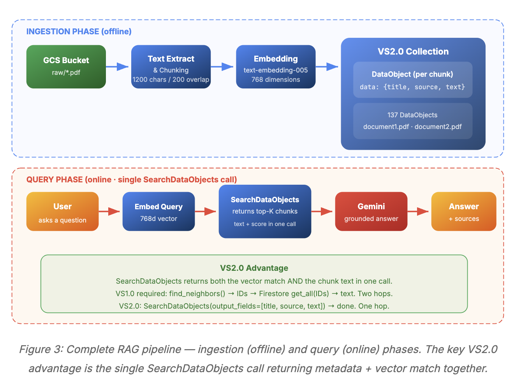

# Vertex AI RAG Designs

A collection of Retrieval-Augmented Generation (RAG) design patterns built with **Google Cloud Vertex AI**.

This repository is intended to help experiment with, compare, and extend different RAG architectures using Vertex AI services and supporting GCP components. The goal is to keep each design practical, modular, and easy to evolve as new patterns are added.

## Current Design

### `SimpleVectorSearch_RAG`

This folder contains a **scalable RAG design** built with:

- **Vertex AI Vector Search**
- **Firestore**
- **Gemini**

This design follows a common production-oriented retrieval flow:

1. Ingest documents from a source such as **GCS**
2. Extract text from supported files
3. Split content into chunks
4. Generate embeddings for each chunk
5. Store vectors in **Vertex AI Vector Search**
6. Store chunk metadata in **Firestore**
7. Retrieve relevant chunks at query time
8. Send the retrieved context to **Gemini** for answer generation

## Architecture Overview

### Ingestion Flow

### Retrieval Flow

## Design Summary

The current implementation is designed to support **scalable retrieval** by separating responsibilities across services:

- **Vertex AI Vector Search** stores and retrieves semantic embeddings efficiently
- **Firestore** stores chunk metadata for fast lookup after retrieval
- **Gemini** uses the retrieved context to generate grounded responses

This pattern helps avoid loading the full corpus into memory and supports a cleaner production architecture for larger document collections.

## Ingestion Flow

The ingestion pipeline currently follows this pattern:

- **GCS Bucket** as the raw document source
- **Text Extraction** from files such as PDF, HTML, and TXT
- **Chunking** of extracted text into manageable overlapping chunks
- **Embedding** using a Vertex AI embedding model
- **Upsert to Vector Search** for semantic retrieval
- **Write to Firestore** for metadata persistence

This allows the system to retrieve only the most relevant chunk IDs from Vector Search, then fetch the corresponding metadata from Firestore before passing context to Gemini.

## Why This Design

This design is useful because it provides:

- **Scalability** for larger corpora
- **Separation of vector data and metadata**
- **Efficient retrieval flow**
- **Cleaner production-ready architecture**
- **Flexibility to swap or improve components later**

## Repository Goal

This repository will continue to grow with additional RAG designs over time.

Planned direction includes:

- simpler baseline RAG patterns
- alternative indexing strategies
- metadata-aware retrieval
- hybrid search patterns
- evaluation-focused designs
- multi-step and agentic RAG workflows

## Notes

This repository is a work in progress and will be expanded with more RAG design patterns later.

For now, `SimpleVectorSearch_RAG` serves as the initial reference implementation for a scalable Vertex AI-based RAG architecture.

## How to RUN

1. Clone the repository:

   git clone https://github.com/DhunganaKB/RAG_VertexAI_VectorSearch.git

2. Move into the repository root:

   cd RAG_VertexAI_VectorSearch

3. Go to the design folder you want to run:

   cd SimpleVectorSearch_RAG

4. Follow the setup and run instructions in that folder’s README.md.

## VectorSearch20_RAG

This folder contains a simplified **RAG design built with Vertex AI Vector Search 2.0 Collections and Gemini**.

Unlike the previous design (`SimpleVectorSearch_RAG`) which required multiple services, this architecture demonstrates how a complete Retrieval-Augmented Generation pipeline can be built using **a single Vector Search resource for both vectors and metadata storage**.

### Key Technologies

This design uses:

- **Vertex AI Vector Search 2.0**
- **Gemini**
- **Google Cloud Storage (GCS)**

Vector Search 2.0 introduces a new data model based on **Collections** and **DataObjects**, allowing embeddings, text chunks, and metadata to be stored together in a single system. This removes the need for an external metadata database such as Firestore.

---

## Architecture Overview

This design follows a simplified RAG workflow:

1. Documents are stored in **Google Cloud Storage (GCS)**.
2. Text is extracted and split into chunks.
3. Each chunk is converted into an embedding.
4. The chunk text, metadata, and embedding are stored together as a **DataObject** inside a **Vector Search Collection**.
5. At query time:
   - The user query is embedded.
   - Vector Search retrieves the most semantically similar chunks.
   - The retrieved chunks are sent to **Gemini**.
6. Gemini generates the final grounded response using the retrieved context.

This architecture eliminates the need for a separate metadata store and reduces the retrieval flow to **a single search call**.

---

## Design Summary

This implementation highlights the architectural shift introduced by **Vector Search 2.0**:

| Feature | Vector Search 1.0 Design | Vector Search 2.0 Design |
|---|---|---|
| Metadata storage | Firestore | Stored directly in the Collection |
| Retrieval flow | Vector search → Firestore lookup | Single `SearchDataObjects` call |
| Infrastructure | Multiple GCP resources | Single Collection |
| Deployment | Requires index deployment | Serverless |

Because embeddings and metadata are stored together, the system can return the relevant chunks and metadata in a single query, simplifying the RAG pipeline.

---

### Design

## Ingestion Flow

The ingestion pipeline follows these steps:

- **GCS Bucket** as the document source
- **Text extraction** from PDF files
- **Chunking** of extracted text into overlapping segments
- **Embedding generation** using a Vertex AI embedding model
- **DataObject creation** containing:
  - metadata (`title`, `source`, `text`)
  - embedding vector
- **Batch insertion** into a **Vector Search 2.0 Collection**

Each chunk becomes a **DataObject** inside the collection.

---

## Retrieval Flow

At query time the pipeline follows this pattern:

1. User question is received by the API.
2. The query is converted to an embedding.
3. `SearchDataObjects` retrieves the top matching chunks from the Collection.
4. The retrieved chunk text and metadata are assembled into context.
5. The context is sent to **Gemini** for answer generation.
6. Gemini produces a grounded response along with sources.

Because the metadata and text are already stored in the collection, **no additional database lookup is required**.

---

## Why This Design

This architecture demonstrates the benefits of **Vector Search 2.0 Collections**:

- Simpler architecture with fewer services
- Unified storage for vectors and metadata
- Single-step retrieval
- Serverless scaling
- Cleaner RAG implementation
- Easier development and experimentation

This makes it a good design for teams experimenting with **simpler RAG pipelines or rapid prototyping on Google Cloud**.

---

## Repository Goal

This repository explores different **RAG architecture patterns on Google Cloud**.

Each folder demonstrates a different design approach, such as:

- baseline scalable RAG patterns
- simplified vector-only architectures
- metadata-aware retrieval patterns
- hybrid search approaches
- evaluation-oriented pipelines
- agentic and multi-step RAG workflows

Over time this repository will grow into a **collection of practical RAG reference implementations**.

---

## Notes

This repository is a **work in progress** and new RAG designs will be added gradually.

The `VectorSearch20_RAG` project demonstrates how to build a RAG system using the **new Collection-based architecture introduced in Vertex AI Vector Search 2.0**.

It serves as a simplified alternative to the earlier **Vector Search + Firestore** pattern and highlights how the new design reduces infrastructure complexity while keeping retrieval scalable.

---

## How to Run

Clone the repository:

git clone https://github.com/DhunganaKB/RAG_VertexAI_VectorSearch.git

Move into the repository root:

cd RAG_VertexAI_VectorSearch

Go to the design folder you want to run:

cd RAGVectoSearch20

Follow the setup and run instructions in that folder’s `README.md`.

Each design in this repository contains its **own setup instructions and environment configuration**.

As more RAG designs are added, you can explore each folder and follow the corresponding READ

This repository is organized so that each RAG design has its own folder and its own local setup instructions. As more designs are added, you can enter the relevant folder and follow its dedicated README.md.
