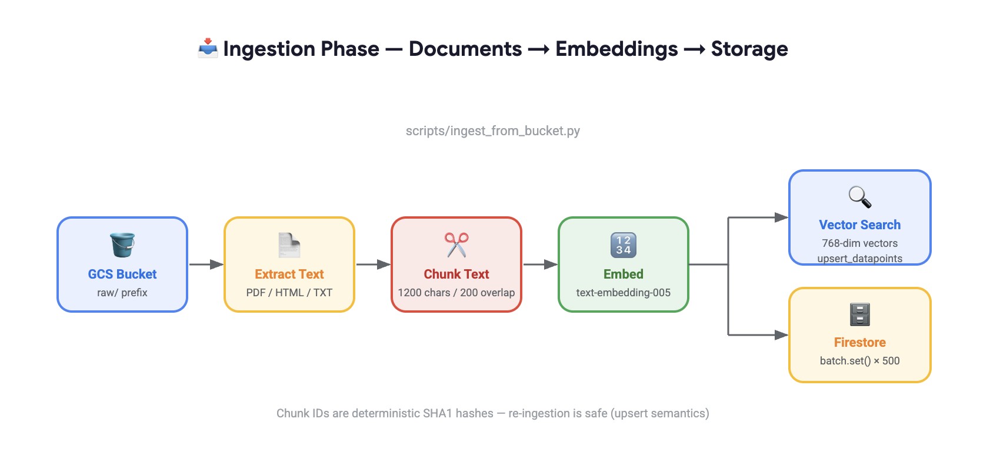
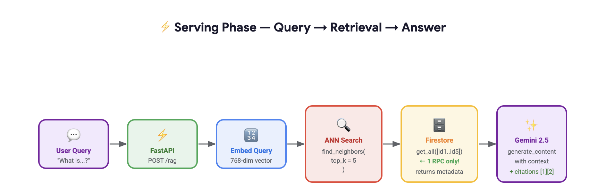

# Vertex AI RAG Designs

A collection of Retrieval-Augmented Generation (RAG) design patterns built with **Google Cloud Vertex AI**.

This repository is intended to help experiment with, compare, and extend different RAG architectures using Vertex AI services and supporting GCP components. The goal is to keep each design practical, modular, and easy to evolve as new patterns are added.

## Current Design

### `SimpleVectorSearch_RAG`

This folder contains a **scalable RAG design** built with:

- **Vertex AI Vector Search**
- **Firestore**
- **Gemini**

This design follows a common production-oriented retrieval flow:

1. Ingest documents from a source such as **GCS**
2. Extract text from supported files
3. Split content into chunks
4. Generate embeddings for each chunk
5. Store vectors in **Vertex AI Vector Search**
6. Store chunk metadata in **Firestore**
7. Retrieve relevant chunks at query time
8. Send the retrieved context to **Gemini** for answer generation

## Architecture Overview

### Ingestion Flow

### Retrieval Flow

## Design Summary

The current implementation is designed to support **scalable retrieval** by separating responsibilities across services:

- **Vertex AI Vector Search** stores and retrieves semantic embeddings efficiently
- **Firestore** stores chunk metadata for fast lookup after retrieval
- **Gemini** uses the retrieved context to generate grounded responses

This pattern helps avoid loading the full corpus into memory and supports a cleaner production architecture for larger document collections.

## Ingestion Flow

The ingestion pipeline currently follows this pattern:

- **GCS Bucket** as the raw document source
- **Text Extraction** from files such as PDF, HTML, and TXT
- **Chunking** of extracted text into manageable overlapping chunks
- **Embedding** using a Vertex AI embedding model
- **Upsert to Vector Search** for semantic retrieval
- **Write to Firestore** for metadata persistence

This allows the system to retrieve only the most relevant chunk IDs from Vector Search, then fetch the corresponding metadata from Firestore before passing context to Gemini.

## Why This Design

This design is useful because it provides:

- **Scalability** for larger corpora
- **Separation of vector data and metadata**
- **Efficient retrieval flow**
- **Cleaner production-ready architecture**
- **Flexibility to swap or improve components later**

## Repository Goal

This repository will continue to grow with additional RAG designs over time.

Planned direction includes:

- simpler baseline RAG patterns
- alternative indexing strategies
- metadata-aware retrieval
- hybrid search patterns
- evaluation-focused designs
- multi-step and agentic RAG workflows

## Notes

This repository is a work in progress and will be expanded with more RAG design patterns later.

For now, `SimpleVectorSearch_RAG` serves as the initial reference implementation for a scalable Vertex AI-based RAG architecture.

## How to RUN

1. Clone the repository:

   git clone https://github.com/DhunganaKB/RAG_VertexAI_VectorSearch.git

2. Move into the repository root:

   cd RAG_VertexAI_VectorSearch

3. Go to the design folder you want to run:

   cd SimpleVectorSearch_RAG

4. Follow the setup and run instructions in that folder’s README.md.

This repository is organized so that each RAG design has its own folder and its own local setup instructions. As more designs are added, you can enter the relevant folder and follow its dedicated README.md.
